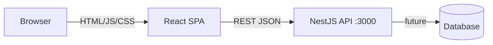

<!-- last-init: 2026-05-23 -->

# Architecture

## Overview

Code Connect is an educational full-stack monorepo: a **React SPA** (Atomic Design + Tailwind) and a **RESTful NestJS API** in a pnpm workspace. The frontend composes UI in layers from atoms to pages; the backend exposes resource-oriented HTTP endpoints with correct verbs and status codes.

Integration will grow via JSON over HTTP from the web app to the API (stateless, no session on server).

## System diagram



## Repository layout

```
code-connect/
├── apps/
│   ├── api/                    # REST API (NestJS)
│   │   └── src/
│   │       └── [feature]/      # module, controller, service, dto
│   └── web/                    # React SPA (Vite + Tailwind)
│       └── src/
│           ├── components/
│           │   ├── atoms/
│           │   ├── molecules/
│           │   ├── organisms/
│           │   └── templates/
│           └── pages/
├── docs/
├── .cursor/rules/
└── package.json
```

## Applications / services

### API (`apps/api`)

- **Stack**: NestJS 11, Express, Jest, class-validator (when added)
- **Style**: REST — plural resource paths, HTTP method semantics, JSON DTOs
- **Port**: `3000` (`PORT` env optional)
- **Entry**: `src/main.ts`

### Web (`apps/web`)

- **Stack**: React 19, Vite 8, Tailwind CSS, Vitest + Testing Library
- **Style**: Atomic Design component tree; Tailwind for styling
- **Entry**: `src/main.tsx` → pages compose templates/organisms
- **Quality gate**: each component ships with a co-located essential-usage test

## Data flow

1. User interacts with a **page** built from templates and organisms.
2. Page calls API client (fetch/axios) → `GET/POST/PATCH/DELETE` on resource URLs.
3. Nest **controller** validates DTO, delegates to **service**, returns JSON + HTTP status.
4. UI updates from response; errors map to user-visible feedback by status code.

## Key dependencies

| Layer    | Technology              | Notes |
| -------- | ----------------------- | ----- |
| Workspace| pnpm                    | `apps/*` |
| Frontend | React, Vite, Tailwind   | Atomic Design folders |
| Frontend tests | Vitest, RTL       | One test file per component |
| Backend  | NestJS, Jest, supertest | REST e2e assertions |
| Git      | Conventional Commits    | `type(scope): msg` |

## Environment

No `.env.example` yet. API uses optional `PORT`. Document new vars when added.

## Deployment

Not configured yet. Build: `apps/api/dist`, `apps/web/dist`.
