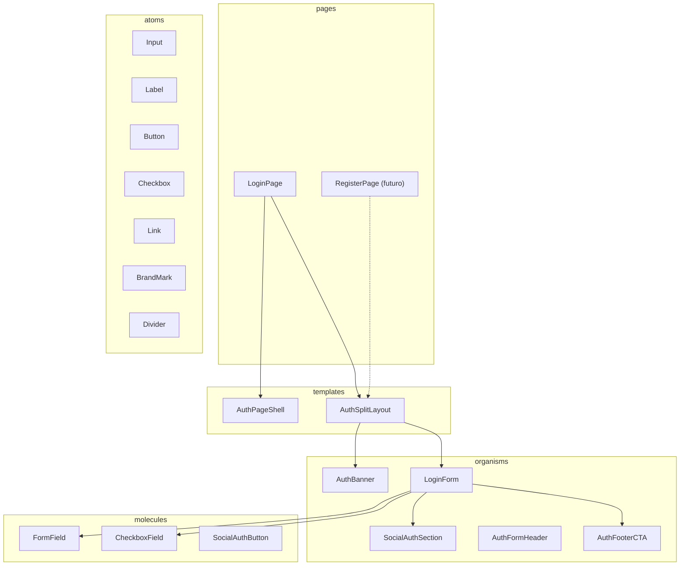

# Plano: Página de Login (Atomic Design + reuso)

## Contexto atual

- [`apps/web`](../apps/web) ainda usa o starter Vite ([`App.tsx`](../apps/web/src/App.tsx) + [`App.css`](../apps/web/src/App.css)).
- **Tailwind e Vitest não estão instalados** — obrigatórios pelas regras em [`.cursor/rules/frontend-patterns.mdc`](../.cursor/rules/frontend-patterns.mdc) e [`docs/CONVENTIONS.md`](../docs/CONVENTIONS.md).
- Assets prontos: [`apps/web/public/github.svg`](../apps/web/public/github.svg), [`apps/web/public/gmail.svg`](../apps/web/public/gmail.svg), [`apps/web/public/banner-login.png`](../apps/web/public/banner-login.png).

## Arquitetura de componentes



### Reuso login vs cadastro

| Peça | Login | Cadastro (futuro) |
|------|-------|-------------------|
| `AuthPageShell` | fundo escuro + padrão decorativo | igual |
| `AuthSplitLayout` | card 2 colunas | igual |
| `AuthBanner` | `bannerSrc="/banner-login.png"` | outro PNG (ex. `banner-register.png`) |
| Formulário | `LoginForm` | `RegisterForm` (novo organism) |
| Header / footer | textos de login | textos de cadastro |

**API do template reutilizável:**

```tsx
// AuthSplitLayout — só layout, sem lógica de auth
type AuthSplitLayoutProps = {
  banner: React.ReactNode
  children: React.ReactNode
}

// AuthBanner — imagem + slot opcional para marca no rodapé
type AuthBannerProps = {
  src: string
  alt: string
  footer?: React.ReactNode
}
```

`LoginPage` apenas compõe template + organisms; cadastro replicará o mesmo padrão trocando `banner` e `children`.

---

## Fase 1 — Tooling (pré-requisito)

### Tailwind CSS v4 + Vite

- Instalar em `apps/web`: `tailwindcss`, `@tailwindcss/vite`.
- Atualizar [`vite.config.ts`](../apps/web/vite.config.ts): plugin Tailwind + alias `@` → `src`.
- Substituir [`src/index.css`](../apps/web/src/index.css) por `@import "tailwindcss"` e tokens no `@theme`:

| Token | Uso no mockup |
|-------|----------------|
| `auth-bg` | fundo da página (~`#01080E`) |
| `auth-card` | painel do card (~`#111` / `#1a1a1a`) |
| `auth-input` | inputs (~`#333`) |
| `auth-primary` | botão verde (~`#7CFF7C` / `#7CFC00`) |
| `auth-muted` | subtítulos / divisor |

- Remover dependência de [`App.css`](../apps/web/src/App.css) após migração.

### Vitest + Testing Library

- Instalar: `vitest`, `@vitest/ui`, `jsdom`, `@testing-library/react`, `@testing-library/user-event`, `@testing-library/jest-dom`.
- Config em [`vite.config.ts`](../apps/web/vite.config.ts) (`test.environment: 'jsdom'`).
- Setup: `src/test/setup.ts` com `@testing-library/jest-dom`.
- Scripts: `test` / `test:watch` em [`apps/web/package.json`](../apps/web/package.json); `test:web` no [`package.json`](../package.json) raiz.

### Roteamento (mínimo para cadastro futuro)

- `react-router-dom` em `apps/web`.
- [`main.tsx`](../apps/web/src/main.tsx): `BrowserRouter` + rotas `/login` (página atual) e redirect `/` → `/login`.
- Link “Crie seu cadastro!” como `<Link to="/cadastro">` com rota placeholder (página vazia ou “em breve”) — **sem** implementar formulário de cadastro.

---

## Fase 2 — Atoms (pasta + teste cada um)

Estrutura: `src/components/atoms/<Name>/{Name}.tsx, Name.test.tsx, index.ts}`.

| Atom | Comportamento |
|------|----------------|
| **Input** | `type`, `placeholder`, `value`, `onChange`, `id`, `disabled`; classes Tailwind do mockup |
| **Label** | `htmlFor`, texto |
| **Button** | variantes `primary` (verde, texto preto) e `ghost`; suporta `type="submit"` |
| **Checkbox** | controlado + `aria-checked` |
| **Link** | variantes `muted` (sublinhado branco) e `accent` (verde bold) |
| **Divider** | linha + texto central (“ou entre com outras contas”) |
| **BrandMark** | ícone verde (duplo elo — SVG inline mínimo ou texto) + “code connect” no rodapé do banner |

Testes essenciais por atom: render, interação onde couber (click no Button, toggle Checkbox, digitar no Input).

---

## Fase 3 — Molecules

| Molecule | Composição |
|----------|------------|
| **FormField** | `Label` + `Input` |
| **CheckboxField** | `Checkbox` + label “Lembrar-me” |
| **SocialAuthButton** | `` ou gmail + legenda; `button type="button"` (sem OAuth ainda) |

Testes: campo renderiza label associado; social button expõe nome acessível (“Github”, “Gmail”).

---

## Fase 4 — Organisms

| Organism | Conteúdo (mockup) |
|----------|-------------------|
| **AuthFormHeader** | título “Login”, subtítulo “Boas-vindas! Faça seu login.” |
| **LoginForm** | `FormField` email/senha, linha `CheckboxField` + link “Esqueci a senha”, `Button` “Login →”; `onSubmit` com `preventDefault` (sem API por enquanto) |
| **SocialAuthSection** | `Divider` + dois `SocialAuthButton` |
| **AuthFooterCTA** | “Ainda não tem conta?” + link cadastro |
| **AuthBanner** | `img` cover na coluna esquerda + `footer={<BrandMark />}` |

Testes: LoginForm submete sem reload; checkbox alterna; link cadastro presente; SocialAuthSection lista Github/Gmail.

---

## Fase 5 — Templates + Page

### AuthPageShell

- `min-h-screen`, fundo `auth-bg`, padrão decorativo nos cantos (CSS: imagem repetida leve ou pseudo-elementos com opacidade baixa — sem novo asset obrigatório na v1).
- Centraliza o card.

### AuthSplitLayout

- Card `rounded-2xl`, `overflow-hidden`, grid `md:grid-cols-2`.
- Coluna esquerda: slot `banner`; direita: slot `children` com padding consistente.
- Responsivo: em mobile, banner acima do formulário (stack).

### LoginPage

```tsx
<AuthPageShell>
  <AuthSplitLayout
    banner={
      <AuthBanner
        src="/banner-login.png"
        alt="Desenvolvedora trabalhando em ambiente digital"
        footer={<BrandMark />}
      />
    }
  >
    <AuthFormHeader title="Login" subtitle="Boas-vindas! Faça seu login." />
    <LoginForm />
    <SocialAuthSection />
    <AuthFooterCTA
      message="Ainda não tem conta?"
      linkText="Crie seu cadastro!"
      linkTo="/cadastro"
    />
  </AuthSplitLayout>
</AuthPageShell>
```

Substituir conteúdo de [`App.tsx`](../apps/web/src/App.tsx) por `<Routes>` ou mover rotas para `App.tsx` enxuto que só declara router.

---

## Fase 6 — Ajustes finais

- **Acessibilidade**: labels ligados aos inputs; `alt` no banner; botões sociais com `aria-label`.
- **Lint/build**: `pnpm lint:web`, `pnpm build:web`, `pnpm test:web`.
- **Limpeza**: remover starter Vite não usado (`App.css`, assets demo se não referenciados).
- **Commit** (quando pedido): `feat(web): add login page with atomic design layout`.

---

## Escopo explícito fora desta entrega

- Integração com API / OAuth GitHub-Gmail
- Página de cadastro completa (apenas rota placeholder + layout reutilizável)
- Logo “code connect” como asset separado (v1: `BrandMark` com SVG inline/texto; refinável depois)

## Ordem de implementação sugerida

1. Tooling (Tailwind, Vitest, router, alias `@`)
2. Atoms + testes
3. Molecules + testes
4. Organisms + testes
5. Templates + LoginPage + wiring router
6. Polish visual vs mockup + lint/test/build
